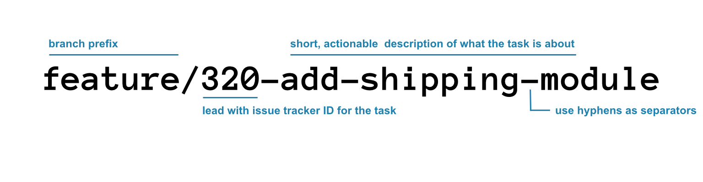
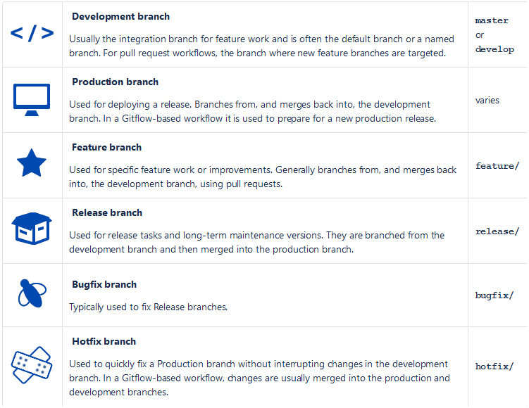

# Git flow standards

A successful [Git Branching Model](https://nvie.com/posts/a-successful-git-branching-model/).


## Git Branch Naming


**1. Branch Prefix**

Also know as Branch Type, this helps identifying branches by type. There are several types of branches 



To configure the branching model for a bitbucket repository (requires repository admin permission):
- Go to Repository settings
- Under Workflow select Branching model
- Choose the details of your repository branching model, then click Save

**2. Use issue tracker IDs in branch names**

this is issue id created in issue tracker like Jira, make it easy to track issue. 
search and filtering issue will be easier, see below
```
$ git checkout feature/2<press TAB>
feature/235-p1-upgrade        feature/235-p2                feature/259-install-avalara
```

**3. Add a short description of the task**

Use a short description of the task after the issue ID makes the branch name recognizable. Make sure that the descriptor is concise & descriptive to give you an idea of the branch.

**4. Use hyphens as separators**

Make sure hyphens are being used consistently for branch naming.


## Git Commit Message

you can include full ID of Jira ticket or Github issue in git commit message, it will be linked to corresponding Jira ticket, or Github issue. in image above, we have DEV-320 is full ID

# References
- [Successfull Git Model](https://nvie.com/posts/a-successful-git-branching-model/)
- [Introducing Bitbucket Branching Model](https://bitbucket.org/blog/introducing-bitbucket-branching-model-support)
- [Branch a repository](https://support.atlassian.com/bitbucket-cloud/docs/branch-a-repository/)
